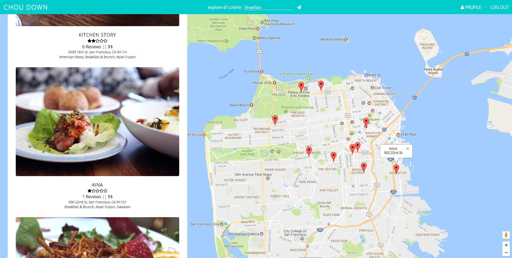
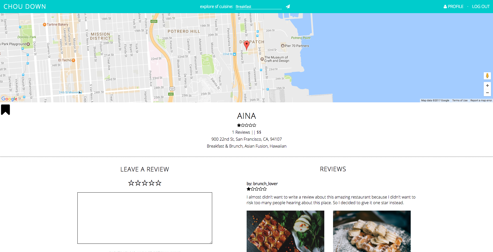
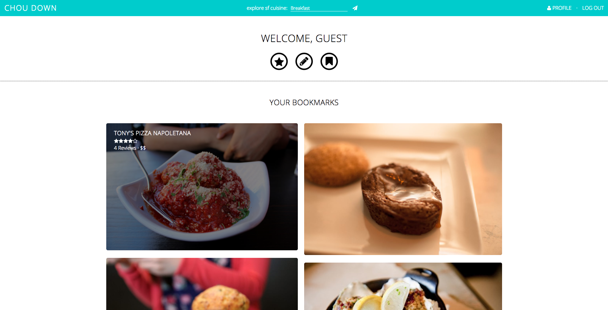
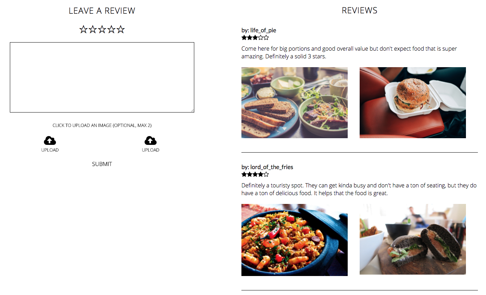
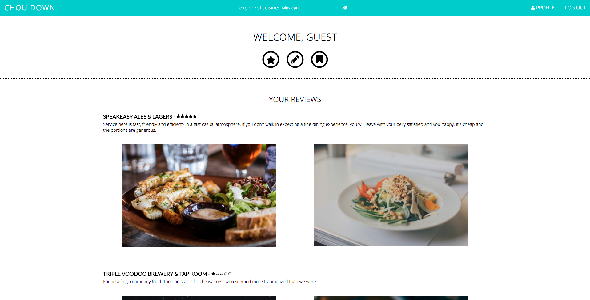

#Chou Down

[Chou Down live][choudown]

Chou Down, a San Francisco restaurant search engine, is a full-stack web application inspired by Yelp. It utilizes Ruby on Rails on the backend, a PostgreSQL database, and React.js with a Redux architectural framework on the front end. No external libraries were used in the styling of this application.

Please see the [docs][docs] folder for design documentation.

## Features & Implementation

### Businesses

Businesses are stored in a `businesses` table. Important columns include `id`, `name`, `street_address`, `lat` (latitude), `long` (longitude), and `image_url` (business image). This table, along with the `tags` table, was seeded using the [Yelp Fusion API][yelp-fusion]. Please see the [seeds.rb][seeds] file for more information on how this data was parsed. All businesses can have multiple `tags` (pizza, breakfast, etc.), `reviews`, and `photos`.

A list of businesses is stored in the state as an object with the `id` field as the key for each business. Businesses are rendered in three different components:
* `BusinessIndex`: This component is displayed after the user searches for a tag, either through the `SearchBar` or by clicking on a popular tag in the `HomeIndex`. The business coordinates are rendered on a map.

<p align="center">
  
</p>

* `BusinessDetail`: This component is displayed when the user clicks on a certain business in the `BusinessIndex` component and shows business information, along with the `ReviewIndex` and `ReviewForm`. Only one business exists in the state object at this time.

<p align="center">
  
</p>

* `ProfileBookmarks`: This component displays all businesses that the current user has bookmarked (which can be done in the `BusinessDetail` component). Businesses are filtered through the `bookmarked` boolean field in the state.

<p align="center">
  
</p>

### Searching with Tags and Price Filters

Tags are stored in a `tags` table and are joined to the `businesses` table through the `taggings` table. When a user searches for a tag (this pushes the tag name to a query string), the `BusinessesController` finds the associated tag(s) in the `tags` table through the `name` column. The associated `business_id`s from the `taggings` table are then found by matching the `id` from the `tags` table to the `tag_id`.

A price filter in the `BusinessIndex` component allows a user to condense a list of businesses by specifying a price point. When the user marks a checkbox, the action pushes a value to the query string and tells the `BusinessesController` to filter out businesses that don't match the specified price(s). The update is instantaneous.  

```ruby
if params[:price]
  price_array = params[:price].split(',')
  @businesses = @businesses.select do |business|
    price_array.include?(business.price)
  end
end
```

### Reviews & Photos

Reviews and photos for businesses are contained in the `reviews` and `photos` tables. Currently, photos can only be uploaded with a review submission. Photo submission is handled by [Cloudinary][cloudinary], a cloud image service.

A list of reviews is stored in the state as an array of objects, which each contain an array of photo objects. Reviews and photos are rendered in two different components:
* `ReviewIndex`: This component is mounted with the `BusinessDetail` component. It displays a list of reviews for a certain business, as well as the associated photos.

<p align="center">
  
</p>

* `ProfileReviews`: This component displays all reviews authored by the current user.

<p align="center">
  
</p>

## Future Directions

### Claiming and Adding Businesses
Yelp allows users add and claim new businesses. I plan on implementing this feature through adding new `BusinessesController` actions and using the Google Maps API to convert addresses to coordinates.

[choudown]: http://www.choudown.com/
[docs]: ./docs
[yelp-fusion]: https://www.yelp.com/developers
[seeds]: ./db/seeds.rb
[cloudinary]: http://cloudinary.com/
